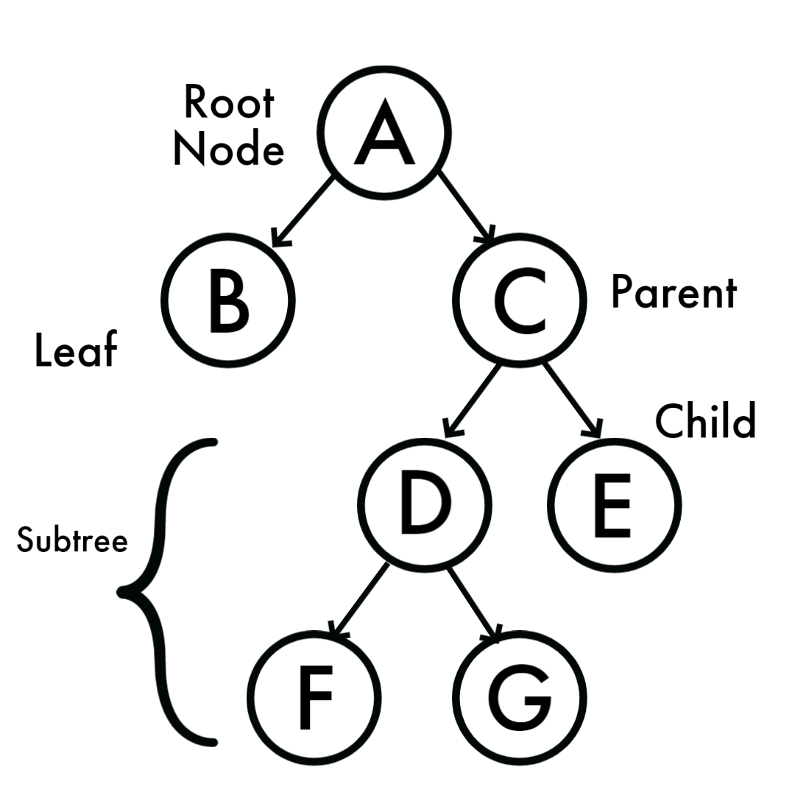
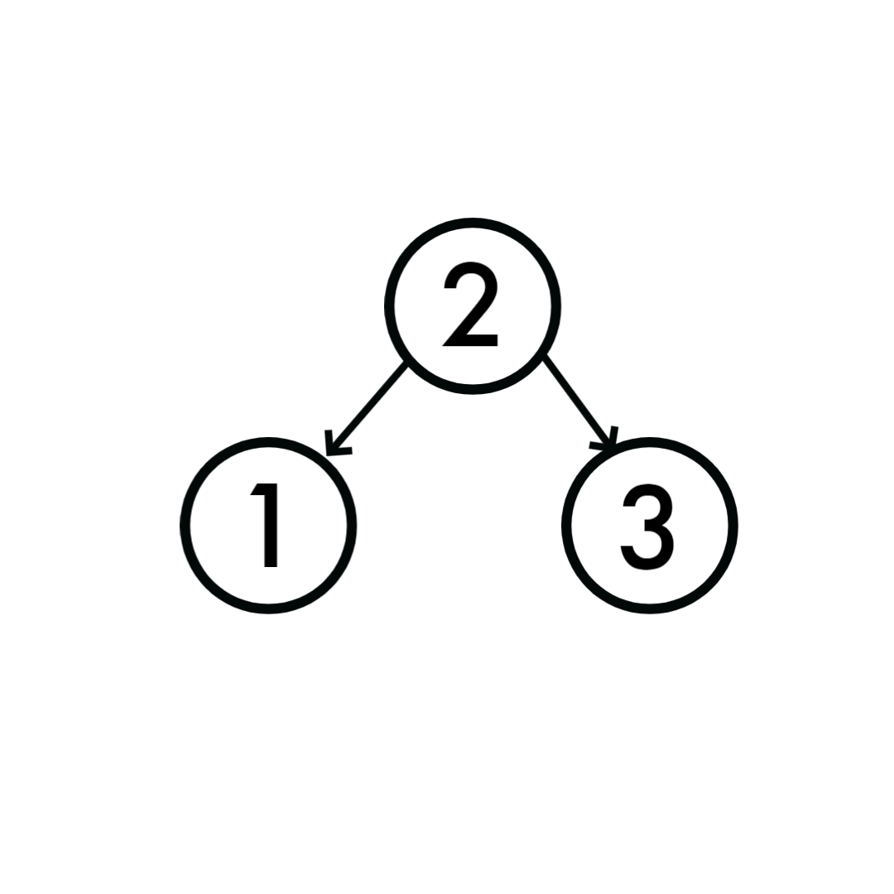
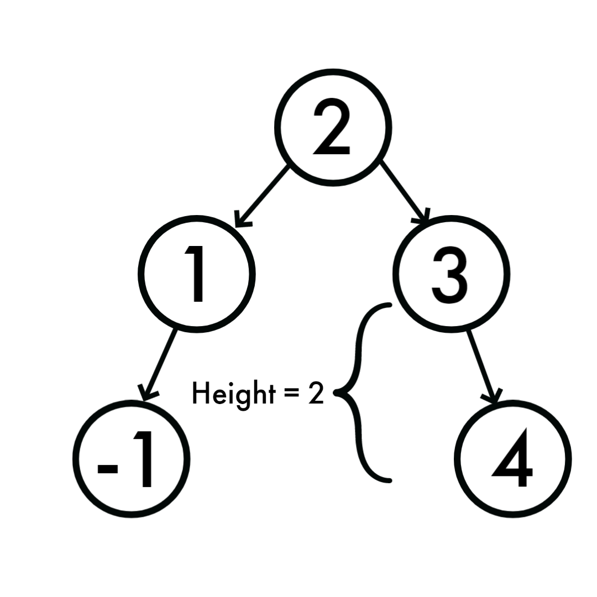

# Unit 3: Trees

Have you ever looked at a family tree before? With each couple in the tree there may be children, and those cildren may have spouses too, and under each child and spouse they have their own children. These trees can go on for a long time, but the root of the tree is Adam and Eve. The data structure Tree is actually quite similar, but instead of having couples, it has nodes. Nodes that sprout from either the left or right of a parent node are known as subtrees.

The very first node in a tree is called the root node. A node that has one node or two nodes attatched is called a parent node, and the node attatched to the parent is called a child node. A node that doesn't have any child nodes itself is called a leaf node.



# Types of Trees

## Binary Search Tree

Binary Search Trees (or BST) have a specific ruleset they need to follow. Each new node inserted into the tree needs to be compared to its parent node. If the child contains a value greater than its parent, it will be inserted to right below the parent node. If its value is less than the parent, it will be inserted below to the left.



Every time you add a new node in a BST it would be compared throughout the whole tree. For example say we wanted to add a node with a value of 4 into our tree pictured in the digram above. Would start at the root which is 2. We know that 4 is greater than 2, so we would go down and right to compare to the next value which is 3. 4 is greater than 3 and would therefore be added below to the right of 3. If we added a node with a value of -1, it would be on the far left with -1 being less than 2, and subsequently less than 1. Another thing to note is that the height of a subtree is simply the number of nodes it contains. For example with the 2 new nodes added to our BST, the height of the subtree on the right would be 2 because it includes the nodes with the values of 3 and 4.



What would happen if we were to make 1 the value of our root, and then we added 2, 3, 4, 5, and so on? Our tree wouldn't look much like a tree, but instead just a line going down and diagnonally to the right and the height of one subtree would be 5 while the other would be only 1. Though this would theoretically work and we would still be able to traverse the tree, it wouldn't be as efficient as it could be. We would instead need to make this tree a Balanced Binary Search Tree or Balanced BST for short.

## Balanced Binary Search Tree

In a Balanced BST, the difference between the height of a subtree and either its right or left counterpart should not be greater than 1 or 2. To create a Balanced BST, one can use the algorithms AVL Trees or Red Black Trees.

# Set-up

To setup a Binary Search Tree you need to create two classes, a node class and a class for the actual tree. The node class will insert a value into itself. In the insert method, the value that is going to be inserted is compared against the "data" variable which in reality means that the value will be compared against every value currently in the tree and will be inserted either right or left depending on if the value is greater or less than the previous node value.

```csharp
public class Node {
    public int Data { get; set; }
    public Node? Right { get; private set; }
    public Node? Left { get; private set; }

    public Node(int data) {
        this.Data = data;
    }
        public void Insert(int value) {
        if (value < Data) {
            // Insert to the left
            if (Left is null)
                Left = new Node(value);
            else
                Left.Insert(value);
        }
        else {
            // Insert to the right
            if (Right is null)
                Right = new Node(value);
            else
                Right.Insert(value);
        }
    }
}

public class BinarySearchTree {
    private Node? _root;
}
```

The Binary Search Tree insert method uses the node insert method, however it first checks to see if the root node contains a value. If no value is found, the value will be inserted into the root. In order to traverse through the tree, we need to make use of the IEnumerable<int> interface

```csharp

public class BinarySearchTree {
    private Node? _root;

    public void Insert(int value) {

        Node newNode = new Node(value);

        if (_root is null)
            _root = newNode;
        else if (!_root.Contains(value))
        {
            _root.Insert(value);
        }
    }

    IEnumerator IEnumerable.GetEnumerator() {
        
        return GetEnumerator();
    }

    public IEnumerator<int> GetEnumerator() {
        var numbers = new List<int>();
        TraverseForward(_root, numbers);
        foreach (var number in numbers) {
            yield return number;
        }
    }

    private void TraverseForward(Node? node, List<int> values) {
        if (node is not null) {
            TraverseForward(node.Left, values);
            values.Add(node.Data);
            TraverseForward(node.Right, values);
        }
    }

}
```

# Problem to Solve

Given an array of strings, find all of the anagrams and return an int that represents the anagram count.

[Solution](Program.cs)

[Back to Welcome Page](welcome.md)
